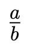
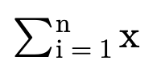
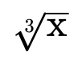
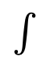
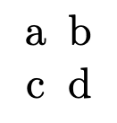
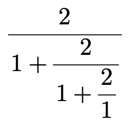

# ZaTeX — KaTeX-compatible math, native in Zig

[](https://github.com/gregoreesmaa/zatex/actions/workflows/ci.yml)
[](docs/support-table.md)
[](https://ziglang.org)
[](LICENSE)

> **The fastest math typesetting library for anywhere but the web.**

ZaTeX reads LaTeX math and lays it out natively: **zero dependencies,
zero heap allocations** on the layout path, **deterministic**
byte-identical output. One layout core feeds every output — native
display list, MathML, SVG, PNG — each emitter a thin walker, never a
second layout engine.

KaTeX is excellent and remains the compatibility reference (its test
corpus and pinned 0.18.7 behavior pin ours). ZaTeX exists for where
KaTeX cannot go: native binaries with no JS runtime — microsecond
layout inside apps that budget kilobytes, not megabytes.

|  |  |  |  |  |  |
| --- | --- | --- | --- | --- | --- |
| `\frac a b` | `\sum` | `\sqrt` | `\int` | `matrix` | `\cfrac` |

*Renders by `zatex-png`; the full per-function gallery is
[docs/katex-syntax.md](docs/katex-syntax.md).*

## Use it

Prerequisite: [Zig 0.16.0](https://ziglang.org/download/).

```sh
# Core test suite (incl. pinned-KaTeX differential sweep)
cd packages/zatex && zig build test --summary all

# Render one formula (run from packages/zatex-png: font paths are CWD-relative)
cd packages/zatex-png && zig build
./zig-out/bin/zatex-png "x^2" out.png
./zig-out/bin/zatex-png --display "\sum_{i=1}^n i^2 = \frac{n(n+1)(2n+1)}{6}" sum.png

# Standalone SVG (outlined paths, no font needed at view time)
cd ../zatex-svg && zig build
./zig-out/bin/zatex-svg "x^2" x2.svg

# Host-cost gate (from the repo root)
./tools/size_gate.sh
```

Embed from Zig with a path dependency:

```zig
.zatex = .{ .path = "path/to/zatex/packages/zatex" },
```

then `b.dependency("zatex", ...)` and `layoutFull` / `layoutDiag` over
caller-owned buffers — see [`examples/`](examples/) (`hello_formula.c`,
`layout.zig`, `mathml.zig`, `render.sh`).

C hosts link `libzatex` and call `zatex_layout_utf8_ex`
([install + load recipe](docs/install.md)).

## Packages

| Package | What | Path |
| --- | --- | --- |
| `zatex` (core) | Parser, macro expander, layout, C ABI. Portable Zig. | `packages/zatex/` |
| `zatex-mathml` | MathML emitter over the core parse tree (no layout math). | `packages/zatex-mathml/` |
| `zatex-svg` | LaTeX → standalone SVG (outlined paths). | `packages/zatex-svg/` |
| `zatex-png` | LaTeX → PNG CLI + visual regression set. One backend per OS. | `packages/zatex-png/` |

One direction only: emitters depend on the core, never the reverse.

## Contracts

* **Compatibility target is KaTeX, not LaTeX.** Anything KaTeX 0.18.7
  rejects, ZaTeX rejects (same error contract). Coverage per function:
  [docs/support-table.md](docs/support-table.md) (editable source) with
  the generated render mirror
  [docs/katex-syntax.md](docs/katex-syntax.md); options/error/font
  behavior: [docs/parity.md](docs/parity.md).
* **Resource contract:** single-pass layout over caller buffers; bounded
  input (64 KiB), bounded macro expansion (`maxExpand` = 1000, KaTeX
  parity), bounded nesting (32); no threads, no network, no bundled
  fonts in the core. Shipped static artifact size-ratcheted
  (`tools/size_gate.sh`, baseline 324 008 bytes).
* **Output contract:** integer font units, y-down from the formula
  top-left; glyph runs + rule rects ([docs/ir.md](docs/ir.md)). Same
  input + same metrics = byte-identical layout.
* **Host duties:** provide metrics via the provider callback, `dlopen`
  per [docs/install.md](docs/install.md), normalize input to NFC
  ([docs/unicode.md](docs/unicode.md)), own threading
  ([docs/threading.md](docs/threading.md)) and delimiter scanning
  ([docs/delimiter-scan.md](docs/delimiter-scan.md)).

## Layout

```text
packages/zatex/src/      core (zatex.zig root, ir.zig, cabi.zig + zatex.h)
packages/zatex-mathml/   MathML emitter (structural walker over the parse tree)
packages/zatex-svg/      SVG emitter (geometric walker over the box tree)
packages/zatex-png/      PNG CLI + screenshots/ regression corpus + baselines
docs/                    contracts, policies, support table + render mirror
examples/                minimal hosts: C, Zig, CLI, MathML, SVG
tools/                   KaTeX sweep harness, size gate, render helpers
planning/                internal plans/specs (not user docs)
.github/                 CI for all packages
```

Tests: each package runs `zig build test` offline and dependency-less
(vendored test font, checked-in KaTeX goldens). Maintainer-only
workflows needing third-party runtimes (Node sweep, Python render
helpers, Docker oracle sweeps) run in CI so contributors never touch
them — see [AGENTS.md](AGENTS.md) for the contributor contract.

Coverage is tracked as GitHub issues, one per KaTeX functionality
group, all verified against pinned KaTeX output. Host-facing ABI
history: [CHANGELOG.md](CHANGELOG.md).

## License

MIT — Copyright (c) 2026 Gregor Eesmaa. See [LICENSE](LICENSE).
