# KaTeX syntax mirror (generated — do not edit)

A render of every accepted function, generated from `docs/support-table.md` by `tools/gen_doc_renders.py` (renders via `zatex-png` into `docs/renders/`; expected render gaps live in `tools/doc_gaps.json`). Status, evidence, and ownership live in the support table — edit that, never this file. Examples use KaTeX's own equations (Source column of the vendored pinned table, else its Rendered column); rows whose KaTeX example this engine cannot render yet are gap-listed with KaTeX's equation.

## Symbols

| Function | Example | Render | Note |
| --- | --- | --- | --- |
| `!` | `n!` | 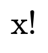 |  |
| `\!` | `a\!b` | 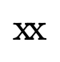 |  |
| `#` | `\def\sqr#1{#1^2} \sqr{y}` |  |  |
| `\#` | `\#` | 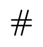 |  |
| `%` | `a% note\nb` | 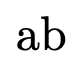 |  |
| `\%` | `\%` | 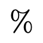 |  |
| `&` | `\begin{matrix}\na & b \\\nc & d\n\end{matrix}` |  |  |
| `\&` | `\&` | 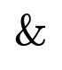 |  |
| `'` | `'` | 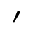 |  |
| `\'` | `\text{\'{a}}` | 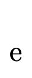 |  |
| `(` | `(` | 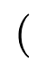 |  |
| `)` | `)` | 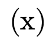 |  |
| `\(…\)` | `\text{\(\frac a b\)}` |  | Delimiters for math islands inside `\text`; top-level `\(x\)` rejects like pinned KaTeX |
| `\ ` | `a\ b` | 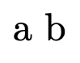 |  |
| `\"` | `\text{\"{a}}` | 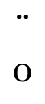 |  |
| `\$` | `\$` | 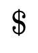 | KaTeX shows `\text{\textdollar}`; this form exercises `\$` |
| `\,` | `a\,\,{b}` |  |  |
| `\.` | `\text{\.{a}}` | 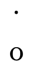 |  |
| `\:` | `a\:\:{b}` | 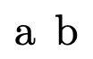 |  |
| `\;` | `a\n\;\;{b}` | 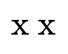 |  |
| `_` | `x_i` | 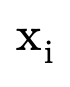 |  |
| `\_` | `\_` |  |  |
| `` \` `` | ``\text{\`{a}}`` | 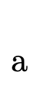 |  |
| `<` | `<` | 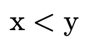 |  |
| `\=` | `\text{\={a}}` | 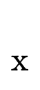 |  |
| `>` | `>` | 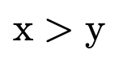 |  |
| `\>` | `a\>\>{b}` | 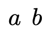 |  |
| `[` | `[` | 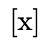 |  |
| `]` | `]` |  |  |
| `{` | `{a}` |  |  |
| `}` | `{a}` | 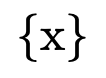 |  |
| `\{` | `\{` |  |  |
| `\}` | `\}` |  |  |
| `&#124;` | `\vert` | 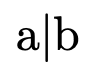 |  |
| `\&#124;` | `\&#124;x\&#124;` | 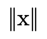 | KaTeX shows `\Vert`; this form exercises `\&#124;` |
| `~` | `\text{no~no~no~breaks}` |  |  |
| `\~` | `\text{\~{a}}` | 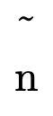 |  |
| `\\ ` | `\begin{matrix}a\\b\end{matrix}` | 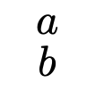 |  |
| `^` | `x^i` | 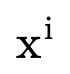 |  |
| `\^` | `\text{\^{a}}` | 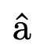 |  |

## A

| Function | Example | Render | Note |
| --- | --- | --- | --- |
| `\AA` | `\text{\AA}` | 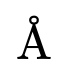 |  |
| `\aa` | `\text{\aa}` | 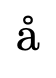 |  |
| `\above` | `{a \above{2pt} b+1}` | 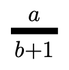 |  |
| `\abovewithdelims` | — | — | goldens: rej-unsup-abovewithdelims |
| `\acute` | `\acute e` | 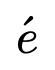 |  |
| `\AE` | `\text{\AE}` | 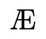 |  |
| `\ae` | `\text{\ae}` | 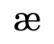 |  |
| `\alef` | `\alef` |  |  |
| `\alefsym` | `\alefsym` | 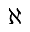 |  |
| `\aleph` | `\aleph` |  |  |
| `{align}` | `\begin{align}\na&=b+c \\\nd+e&=f\n\end{align}` | 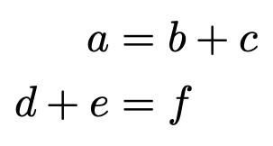 |  |
| `{align*}` | `\begin{align*}\na&=b+c \\\nd+e&=f\n\end{align*}` |  |  |
| `{aligned}` | `\begin{aligned}\na&=b+c \\\nd+e&=f\n\end{aligned}` | 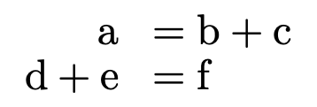 |  |
| `{alignat}` | `\begin{alignat}{2}\n10&x+ &3&y = 2 \\\n 3&x+&13&y = 4\n\end{alignat}` | 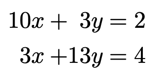 |  |
| `{alignat*}` | `\begin{alignat*}{2}\n10&x+ &3&y = 2 \\\n 3&x+&13&y = 4\n\end{alignat*}` |  |  |
| `{alignedat}` | `\begin{alignedat}{2}\n10&x+ &3&y = 2 \\\n 3&x+&13&y = 4\n\end{alignedat}` |  |  |
| `\allowbreak` | `x \allowbreak y` |  |  |
| `\Alpha` | `\Alpha` | 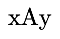 |  |
| `\alpha` | `\alpha` | 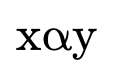 |  |
| `\amalg` | `\amalg` | 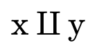 |  |
| `\And` | `\And` | 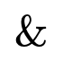 |  |
| `\and` | — | — | goldens: rej-unsup-and |
| `\ang` | — | — | goldens: rej-unsup-ang |
| `\angl` | `a_{\angl n}` | 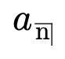 |  |
| `\angln` | `a_\angln` |  |  |
| `\angle` | `\angle` | 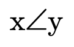 |  |
| `\approx` | `\approx` | 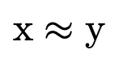 |  |
| `\approxeq` | `\approxeq` | 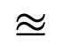 |  |
| `\approxcolon` | `\approxcolon` | 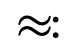 |  |
| `\approxcoloncolon` | `\approxcoloncolon` | 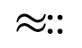 |  |
| `\arccos` | `\arccos` |  |  |
| `\arcctg` | `\arcctg` |  |  |
| `\arcsin` | `\arcsin` |  |  |
| `\arctan` | `\arctan` |  |  |
| `\arctg` | `\arctg` |  |  |
| `\arg` | `\arg` |  |  |
| `\argmax` | `\argmax` |  |  |
| `\argmin` | `\argmin` |  |  |
| `{array}` | `\begin{array}{cc}\na & b \\\nc & d\n\end{array}` |  |  |
| `\array` | — | — | goldens: rej-unsup-array |
| `\arraystretch` | `\def\arraystretch{1.5}\n\begin{array}{cc}\na & b \\\nc & d\n\end{array}` |  |  |
| `\Arrowvert` | — | — | goldens: rej-unsup-arrowvert |
| `\arrowvert` | — | — | goldens: rej-unsup-arrowvert-2 |
| `\ast` | `\ast` |  |  |
| `\asymp` | `\asymp` |  |  |
| `\atop` | `{a \atop b}` |  |  |
| `\atopwithdelims` | — | — | goldens: rej-unsup-atopwithdelims |

## B

| Function | Example | Render | Note |
| --- | --- | --- | --- |
| `\backepsilon` | `\backepsilon` |  |  |
| `\backprime` | `\backprime` |  |  |
| `\backsim` | `\backsim` |  |  |
| `\backsimeq` | `\backsimeq` |  |  |
| `\backslash` | `\backslash` |  |  |
| `\bar` | `\bar{y}` |  |  |
| `\barwedge` | `\barwedge` |  |  |
| `\Bbb` | `\Bbb{ABC}` |  |  |
| `\Bbbk` | `\Bbbk` |  |  |
| `\bbox` | — | — | goldens: rej-unsup-bbox |
| `\bcancel` | `\bcancel{5}` |  |  |
| `\because` | `\because` |  |  |
| `\begin` | `\begin{matrix}\na & b \\\nc & d\n\end{matrix}` |  |  |
| `\begingroup` | `\begingroup x\endgroup` |  |  |
| `\Beta` | `\Beta` |  |  |
| `\beta` | `\beta` |  |  |
| `\beth` | `\beth` |  |  |
| `\between` | `\between` |  |  |
| `\bf` | `\bf AaBb12` |  |  |
| `\bfseries` | — | — | goldens: rej-unsup-bfseries |
| `\bgroup` | `\bgroup x}` |  |  |
| `\big` | `\big(\big)` |  |  |
| `\Big` | `\Big(\Big)` |  |  |
| `\bigcap` | `\bigcap` |  |  |
| `\bigcirc` | `\bigcirc` |  |  |
| `\bigcup` | `\bigcup` |  |  |
| `\bigg` | `\bigg(\bigg)` |  |  |
| `\Bigg` | `\Bigg(\Bigg)` |  |  |
| `\biggl` | `\biggl(` |  |  |
| `\Biggl` | `\Biggl(` |  |  |
| `\biggm` | `\biggm\vert` |  |  |
| `\Biggm` | `\Biggm\vert` |  |  |
| `\biggr` | `\biggr)` |  |  |
| `\Biggr` | `\Biggr)` |  |  |
| `\bigl` | `\bigl(` |  |  |
| `\Bigl` | `\Bigl(` |  |  |
| `\bigm` | `\bigm\vert` |  |  |
| `\Bigm` | `\Bigm\vert` |  |  |
| `\bigodot` | `\bigodot` |  |  |
| `\bigominus` | — | — | goldens: rej-unsup-bigominus |
| `\bigoplus` | `\bigoplus` |  |  |
| `\bigoslash` | — | — | goldens: rej-unsup-bigoslash |
| `\bigotimes` | `\bigotimes` |  |  |
| `\bigr` | `\bigr)` |  |  |
| `\Bigr` | `\Bigr)` |  |  |
| `\bigsqcap` | — | — | goldens: rej-unsup-bigsqcap |
| `\bigsqcup` | `\bigsqcup` |  |  |
| `\bigstar` | `\bigstar` |  |  |
| `\bigtriangledown` | `\bigtriangledown` |  |  |
| `\bigtriangleup` | `\bigtriangleup` |  |  |
| `\biguplus` | `\biguplus` |  |  |
| `\bigvee` | `\bigvee` |  |  |
| `\bigwedge` | `\bigwedge` |  |  |
| `\binom` | `\binom n k` |  |  |
| `\blacklozenge` | `\blacklozenge` |  |  |
| `\blacksquare` | `\blacksquare` |  |  |
| `\blacktriangle` | `\blacktriangle` |  |  |
| `\blacktriangledown` | `\blacktriangledown` |  |  |
| `\blacktriangleleft` | `\blacktriangleleft` |  |  |
| `\blacktriangleright` | `\blacktriangleright` |  |  |
| `\bm` | `\bm{AaBb}` |  |  |
| `{Bmatrix}` | `\begin{Bmatrix}\na & b \\\nc & d\n\end{Bmatrix}` |  |  |
| `{Bmatrix*}` | `\begin{Bmatrix*}[r]\n0 & -1 \\\n-1 & 0\n\end{Bmatrix*}` |  |  |
| `{bmatrix}` | `\begin{bmatrix}\na & b \\\nc & d\n\end{bmatrix}` |  |  |
| `{bmatrix*}` | `\begin{bmatrix*}[r]\n0 & -1 \\\n-1 & 0\n\end{bmatrix*}` |  |  |
| `\bmod` | `a \bmod b` |  |  |
| `\bold` | `\bold{AaBb123}` |  |  |
| `\boldsymbol` | `\boldsymbol{AaBb}` |  |  |
| `\bot` | `\bot` |  |  |
| `\bowtie` | `\bowtie` |  |  |
| `\Box` | `\Box` |  |  |
| `\boxdot` | `\boxdot` |  |  |
| `\boxed` | `\boxed{ab}` |  |  |
| `\boxminus` | `\boxminus` |  |  |
| `\boxplus` | `\boxplus` |  |  |
| `\boxtimes` | `\boxtimes` |  |  |
| `\Bra` | `\Bra{\psi}` |  |  |
| `\bra` | `\bra{\psi}` |  |  |
| `\braket` | `\braket{\phi&#124;\psi}` |  |  |
| `\Braket` | `\Braket{\phi&#124;\frac12&#124;\psi}` |  |  |
| `\brace` | `{n\brace k}` |  |  |
| `\bracevert` | — | — | goldens: rej-unsup-bracevert |
| `\brack` | `{n\brack k}` |  |  |
| `\breve` | `\breve{eu}` |  |  |
| `\buildrel` | — | — | goldens: rej-unsup-buildrel |
| `\bull` | `\bull` |  |  |
| `\bullet` | `\bullet` |  |  |
| `\Bumpeq` | `\Bumpeq` |  |  |
| `\bumpeq` | `\bumpeq` |  |  |

## C

| Function | Example | Render | Note |
| --- | --- | --- | --- |
| `\C` | — | — | goldens: rej-unsup-c |
| `\cal` | `\cal AaBb123` |  |  |
| `\cancel` | `\cancel{5}` |  |  |
| `\cancelto` | — | — | goldens: rej-unsup-cancelto |
| `\Cap` | `\Cap` |  |  |
| `\cap` | `\cap` |  |  |
| `{cases}` | `\begin{cases}\na &\text{if } b  \\\nc &\text{if } d\n\end{cases}` |  |  |
| `\cases` | — | — | goldens: rej-unsup-cases |
| `{CD}` | `\begin{CD}\nA  @>a>>  B  \\\n@VbVV    @AAcA \\\nC  @=     D\n\end{CD}` |  |  |
| `\cdot` | `\cdot` |  |  |
| `\cdotp` | `\cdotp` |  |  |
| `\cdots` | `\cdots` |  |  |
| `\ce` | — | — | goldens: rej-unsup-ce |
| `\cee` | — | — | goldens: rej-unsup-cee |
| `\centerdot` | `a\centerdot b` |  |  |
| `\cf` | — | — | goldens: rej-unsup-cf |
| `\cfrac` | `\cfrac{2}{1+\cfrac{2}{1+\cfrac{2}{1}}}` |  |  |
| `\char` | `\char"263a` |  |  |
| `\check` | `\check{oe}` |  |  |
| `\ch` | `\ch` |  |  |
| `\checkmark` | `\checkmark` |  |  |
| `\Chi` | `\Chi` |  |  |
| `\chi` | `\chi` |  |  |
| `\choose` | `{n+1 \choose k+2}` |  |  |
| `\circ` | `\circ` |  |  |
| `\circeq` | `\circeq` |  |  |
| `\circlearrowleft` | `\circlearrowleft` |  |  |
| `\circlearrowright` | `\circlearrowright` |  |  |
| `\circledast` | `\circledast` |  |  |
| `\circledcirc` | `\circledcirc` |  |  |
| `\circleddash` | `\circleddash` |  |  |
| `\circledR` | `\circledR` |  |  |
| `\circledS` | `\circledS` |  |  |
| `\clap` | `\clap{x}y` |  |  |
| `\class` | — | — | goldens: rej-unsup-class |
| `\cline` | — | — | goldens: rej-unsup-cline |
| `\clubs` | `\clubs` |  |  |
| `\clubsuit` | `\clubsuit` |  |  |
| `\cnums` | `\cnums` |  |  |
| `\colon` | `\colon` |  |  |
| `\Colonapprox` | `\Colonapprox` |  |  |
| `\colonapprox` | `\colonapprox` |  |  |
| `\coloncolon` | `\coloncolon` |  |  |
| `\coloncolonapprox` | `\coloncolonapprox` |  |  |
| `\coloncolonequals` | `\coloncolonequals` |  |  |
| `\coloncolonminus` | `\coloncolonminus` |  |  |
| `\coloncolonsim` | `\coloncolonsim` |  |  |
| `\Coloneq` | `\Coloneq` |  |  |
| `\coloneq` | `\coloneq` |  |  |
| `\colonequals` | `\colonequals` |  |  |
| `\Coloneqq` | `\Coloneqq` |  |  |
| `\coloneqq` | `\coloneqq` |  |  |
| `\colonminus` | `\colonminus` |  |  |
| `\Colonsim` | `\Colonsim` |  |  |
| `\colonsim` | `\colonsim` |  |  |
| `\color` | `\color{#0000FF} AaBb123` |  |  |
| `\colorbox` | `\colorbox{red}{Black on red}` |  |  |
| `\complement` | `\complement` |  |  |
| `\Complex` | `\Complex` |  |  |
| `\cong` | `\cong` |  |  |
| `\Coppa` | — | — | goldens: rej-unsup-coppa |
| `\coppa` | — | — | goldens: rej-unsup-coppa-2 |
| `\coprod` | `\coprod` |  |  |
| `\copyright` | `\copyright` |  |  |
| `\cos` | `\cos` |  |  |
| `\cosec` | `\cosec` |  |  |
| `\cosh` | `\cosh` |  |  |
| `\cot` | `\cot` |  |  |
| `\cotg` | `\cotg` |  |  |
| `\coth` | `\coth` |  |  |
| `\cr` | `\begin{matrix}\na & b \cr\nc & d\n\end{matrix}` |  |  |
| `\csc` | `\csc` |  |  |
| `\cssId` | — | — | goldens: rej-unsup-cssid |
| `\ctg` | `\ctg` |  |  |
| `\cth` | `\cth` |  |  |
| `\Cup` | `\Cup` |  |  |
| `\cup` | `\cup` |  |  |
| `\curlyeqprec` | `\curlyeqprec` |  |  |
| `\curlyeqsucc` | `\curlyeqsucc` |  |  |
| `\curlyvee` | `\curlyvee` |  |  |
| `\curlywedge` | `\curlywedge` |  |  |
| `\curvearrowleft` | `\curvearrowleft` |  |  |
| `\curvearrowright` | `\curvearrowright` |  |  |

## D

| Function | Example | Render | Note |
| --- | --- | --- | --- |
| `\dag` | `\dag` |  |  |
| `\Dagger` | `\Dagger` |  |  |
| `\dagger` | `\dagger` |  |  |
| `\daleth` | `\daleth` |  |  |
| `\Darr` | `\Darr` |  |  |
| `\dArr` | `\dArr` |  |  |
| `\darr` | `\darr` |  |  |
| `\dashleftarrow` | `\dashleftarrow` |  |  |
| `\dashrightarrow` | `\dashrightarrow` |  |  |
| `\dashv` | `\dashv` |  |  |
| `\dbinom` | `\dbinom n k` |  |  |
| `\dblcolon` | `\dblcolon` |  |  |
| `{dcases}` | `\begin{dcases}\na &\text{if } b  \\\nc &\text{if } d\n\end{dcases}` |  |  |
| `\ddag` | `\ddag` |  |  |
| `\ddagger` | `\ddagger` |  |  |
| `\ddddot` | `\ddddot x` |  |  |
| `\dddot` | `\dddot x` |  |  |
| `\ddot` | `\ddot x` |  |  |
| `\ddots` | `\ddots` |  |  |
| `\DeclareMathOperator` | — | — | goldens: rej-declare-op |
| `\def` | `\def\foo{x^2} \foo + \foo` |  |  |
| `\definecolor` | — | — | goldens: definecolor |
| `\deg` | `\deg` |  |  |
| `\degree` | `\degree` |  |  |
| `\delta` | `\delta` |  |  |
| `\Delta` | `\Delta` |  |  |
| `\det` | `\det` |  |  |
| `\Digamma` | — | — | goldens: rej-unsup-digamma |
| `\digamma` | `\digamma` |  |  |
| `\dfrac` | `\dfrac{a-1}{b-1}` |  |  |
| `\diagdown` | `\diagdown` |  |  |
| `\diagup` | `\diagup` |  |  |
| `\Diamond` | `\Diamond` |  |  |
| `\diamond` | `\diamond` |  |  |
| `\diamonds` | `\diamonds` |  |  |
| `\diamondsuit` | `\diamondsuit` |  |  |
| `\dim` | `\dim` |  |  |
| `\displaylines` | — | — | goldens: rej-unsup-displaylines |
| `\displaystyle` | `\displaystyle\sum_0^n` |  |  |
| `\div` | `\div` |  |  |
| `\divideontimes` | `\divideontimes` |  |  |
| `\dot` | `\dot x` |  |  |
| `\Doteq` | `\Doteq` |  |  |
| `\doteq` | `\doteq` |  |  |
| `\doteqdot` | `\doteqdot` |  |  |
| `\dotplus` | `\dotplus` |  |  |
| `\dots` | `x_1 + \dots + x_n` |  |  |
| `\dotsb` | `x_1 +\dotsb + x_n` |  |  |
| `\dotsc` | `x,\dotsc,y` |  |  |
| `\dotsi` | `\int_{A_1}\int_{A_2}\dotsi` |  |  |
| `\dotsm` | `x_1 x_2 \dotsm x_n` |  |  |
| `\dotso` | `\dotso` |  |  |
| `\doublebarwedge` | `\doublebarwedge` |  |  |
| `\doublecap` | `\doublecap` |  |  |
| `\doublecup` | `\doublecup` |  |  |
| `\Downarrow` | `\Downarrow` |  |  |
| `\downarrow` | `\downarrow` |  |  |
| `\downdownarrows` | `\downdownarrows` |  |  |
| `\downharpoonleft` | `\downharpoonleft` |  |  |
| `\downharpoonright` | `\downharpoonright` |  |  |
| `{drcases}` | `\begin{drcases}\na &\text{if } b  \\\nc &\text{if } d\n\end{drcases}` |  |  |

## E

| Function | Example | Render | Note |
| --- | --- | --- | --- |
| `\edef` | `\def\foo{a}\edef\fcopy{\foo}\def\foo{}\fcopy` |  |  |
| `\egroup` | `x{a\egroup` |  |  |
| `\ell` | `\ell` |  |  |
| `\else` | — | — | goldens: rej-unsup-else |
| `\em` | — | — | goldens: rej-unsup-em |
| `\emph` | `\emph{x}` |  |  |
| `\empty` | `\empty` |  |  |
| `\emptyset` | `\emptyset` |  |  |
| `\enclose` | — | — | goldens: rej-unsup-enclose |
| `\end` | `\begin{matrix}\na & b \\\nc & d\n\end{matrix}` |  |  |
| `\endgroup` | `\begingroup x\endgroup` |  |  |
| `\enskip` | `x\enskip y` |  |  |
| `\enspace` | `a\enspace b` |  |  |
| `\Epsilon` | `\Epsilon` |  |  |
| `\epsilon` | `\epsilon` |  |  |
| `\eqalign` | — | — | goldens: rej-unsup-eqalign |
| `\eqalignno` | — | — | goldens: rej-unsup-eqalignno |
| `\eqcirc` | `\eqcirc` |  |  |
| `\Eqcolon` | `\Eqcolon` |  |  |
| `\eqcolon` | `\eqcolon` |  |  |
| `{equation}` | `\begin{equation}\na = b + c\n\end{equation}` |  |  |
| `{equation*}` | `\begin{equation*}\na = b + c\n\end{equation*}` |  |  |
| `{eqnarray}` | — | — | goldens: rej-unsup-eqnarray |
| `\Eqqcolon` | `\Eqqcolon` |  |  |
| `\eqqcolon` | `\eqqcolon` |  |  |
| `\eqref` | — | — | goldens: rej-unsup-eqref |
| `\eqsim` | `\eqsim` |  |  |
| `\eqslantgtr` | `\eqslantgtr` |  |  |
| `\eqslantless` | `\eqslantless` |  |  |
| `\equalscolon` | `\equalscolon` |  |  |
| `\equalscoloncolon` | `\equalscoloncolon` |  |  |
| `\equiv` | `\equiv` |  |  |
| `\Eta` | `\Eta` |  |  |
| `\eta` | `\eta` |  |  |
| `\eth` | `\eth` |  |  |
| `\euro` | — | — | goldens: rej-unsup-euro |
| `\exist` | `\exist` |  |  |
| `\exists` | `\exists` |  |  |
| `\exp` | `\exp` |  |  |
| `\expandafter` | `x \expandafter y` |  |  |

## F

| Function | Example | Render | Note |
| --- | --- | --- | --- |
| `\@firstoftwo` | `\@firstoftwo{a}{b}` |  |  |
| `\fallingdotseq` | `\fallingdotseq` |  |  |
| `\fbox` | `\fbox{Hi there!}` |  |  |
| `\fcolorbox` | `\fcolorbox{red}{aqua}{A}` |  |  |
| `\fi` | — | — | goldens: rej-unsup-fi |
| `\Finv` | `\Finv` |  |  |
| `\flat` | `\flat` |  |  |
| `\footnotesize` | `\footnotesize footnotesize` |  |  |
| `\forall` | `\forall` |  |  |
| `\frac` | `\frac a b` |  |  |
| `\frak` | `\frak{AaBb}` |  |  |
| `\frown` | `\frown` |  |  |
| `\futurelet` | `\def\foo{A}\futurelet\a\foo\foo` |  |  |

## G

| Function | Example | Render | Note |
| --- | --- | --- | --- |
| `\Game` | `\Game` |  |  |
| `\Gamma` | `\Gamma` |  |  |
| `\gamma` | `\gamma` |  |  |
| `{gather}` | `\begin{gather}\na=b \\ \ne=b+c\n\end{gather}` |  |  |
| `{gather*}` | `\begin{gather*}a\\b\end{gather*}` |  |  |
| `{gathered}` | `\begin{gathered}\na=b \\ \ne=b+c\n\end{gathered}` |  |  |
| `\gcd` | `\gcd` |  |  |
| `\gdef` | `\gdef\sqr#1{#1^2} \sqr{y} + \sqr{y}` |  |  |
| `\ge` | `\ge` |  |  |
| `\geneuro` | — | — | goldens: rej-unsup-geneuro |
| `\geneuronarrow` | — | — | goldens: rej-unsup-geneuronarrow |
| `\geneurowide` | — | — | goldens: rej-unsup-geneurowide |
| `\genfrac` | `\genfrac ( ] {2pt}{0}a{a+1}` |  |  |
| `\geq` | `\geq` |  |  |
| `\geqq` | `\geqq` |  |  |
| `\geqslant` | `\geqslant` |  |  |
| `\gets` | `\gets` |  |  |
| `\gg` | `\gg` |  |  |
| `\ggg` | `\ggg` |  |  |
| `\gggtr` | `\gggtr` |  |  |
| `\gimel` | `\gimel` |  |  |
| `\global` | `\global\def\add#1#2{#1+#2} \add 2 3` |  |  |
| `\gnapprox` | `\gnapprox` |  |  |
| `\gneq` | `\gneq` |  |  |
| `\gneqq` | `\gneqq` |  |  |
| `\gnsim` | `\gnsim` |  |  |
| `\grave` | `\grave{eu}` |  |  |
| `\gt` | `a \gt b` |  |  |
| `\gtrdot` | `\gtrdot` |  |  |
| `\gtrapprox` | `\gtrapprox` |  |  |
| `\gtreqless` | `\gtreqless` |  |  |
| `\gtreqqless` | `\gtreqqless` |  |  |
| `\gtrless` | `\gtrless` |  |  |
| `\gtrsim` | `\gtrsim` |  |  |
| `\gvertneqq` | `\gvertneqq` |  |  |

## H

| Function | Example | Render | Note |
| --- | --- | --- | --- |
| `\H` | `\text{\H{a}}` |  |  |
| `\Harr` | `\Harr` |  |  |
| `\hArr` | `\hArr` |  |  |
| `\harr` | `\harr` |  |  |
| `\hat` | `\hat{\theta}` |  |  |
| `\hbar` | `\hbar` |  |  |
| `\hbox` | `\hbox{$x^2$}` |  |  |
| `\hbox to <dimen>` | `\hbox to 10pt{A}` |  |  |
| `\hdashline` | `\begin{matrix}\na & b \\\n\hdashline\nc & d\n\end{matrix}` |  |  |
| `\hearts` | `\hearts` |  |  |
| `\heartsuit` | `\heartsuit` |  |  |
| `\hfil` | — | — | goldens: rej-unsup-hfil |
| `\hfill` | — | — | goldens: rej-unsup-hfill |
| `\hline` | `\begin{matrix}\na & b \\ \hline\nc & d\n\end{matrix}` |  |  |
| `\hom` | `\hom` |  |  |
| `\hookleftarrow` | `\hookleftarrow` |  |  |
| `\hookrightarrow` | `\hookrightarrow` |  |  |
| `\hphantom` | `a\hphantom{bc}d` |  |  |
| `\href` | `\href{https://github.com/gregoreesmaa/zatex}{\mathrm{Z\!^AT\!_EX}}` |  |  |
| `\hskip` | `w\hskip1em i\hskip2em d` |  |  |
| `\hslash` | `\hslash` |  |  |
| `\hspace` | `s\hspace7ex k` |  |  |
| `\htmlClass` | `\htmlClass{foo}{x}` |  |  |
| `\htmlData` | `\htmlData{foo=a, bar=b}{x}` |  |  |
| `\htmlId` | `\htmlId{bar}{x}` |  |  |
| `\htmlStyle` | `\htmlStyle{color: red;}{x}` |  |  |
| `\huge` | `\huge huge` |  |  |
| `\Huge` | `\Huge Huge` |  |  |

## I

| Function | Example | Render | Note |
| --- | --- | --- | --- |
| `\@ifnextchar` | `\@ifnextchar{a}{T}{E}a` |  |  |
| `\@ifstar` | `\@ifstar{T}{E}*` |  |  |
| `\i` | `\text{\i}` |  |  |
| `\idotsint` | — | — | goldens: rej-unsup-idotsint |
| `\iddots` | — | — | goldens: rej-unsup-iddots |
| `\if` | — | — | goldens: rej-unsup-if |
| `\iff` | `A\iff B` |  |  |
| `\ifmode` | — | — | goldens: rej-unsup-ifmode |
| `\ifx` | — | — | goldens: rej-unsup-ifx |
| `\iiiint` | — | — | goldens: rej-unsup-iiiint |
| `\iiint` | `\iiint` |  |  |
| `\iint` | `\iint` |  |  |
| `\Im` | `\Im` |  |  |
| `\image` | `\image` |  |  |
| `\imageof` | `\imageof` |  |  |
| `\imath` | `\imath` |  |  |
| `\impliedby` | `P\impliedby Q` |  |  |
| `\implies` | `P\implies Q` |  |  |
| `\in` | `\in` |  |  |
| `\includegraphics` | `\includegraphics[height=0.8em, totalheight=0.9em, width=0.9em, alt=KA logo]{https://cdn.kastatic.org/images/apple-touch-icon-57x57-precomposed.new.png}` |  |  |
| `\inf` | `\inf` |  |  |
| `\infin` | `\infin` |  |  |
| `\infty` | `\infty` |  |  |
| `\injlim` | `\injlim` |  |  |
| `\int` | `\int` |  |  |
| `\intercal` | `\intercal` |  |  |
| `\intop` | `\intop` |  |  |
| `\Iota` | `\Iota` |  |  |
| `\iota` | `\iota` |  |  |
| `\isin` | `\isin` |  |  |
| `\it` | `{\it AaBb}` |  |  |
| `\itshape` | — | — | goldens: rej-unsup-itshape |

## JK

| Function | Example | Render | Note |
| --- | --- | --- | --- |
| `\j` | `\text{\j}` |  |  |
| `\jmath` | `\jmath` |  |  |
| `\Join` | `\Join` |  |  |
| `\Kappa` | `\Kappa` |  |  |
| `\kappa` | `\kappa` |  |  |
| `\KaTeX` | `\KaTeX` |  |  |
| `\ker` | `\ker` |  |  |
| `\kern` | `I\kern-2.5pt R` |  |  |
| `\Ket` | `\Ket{\psi}` |  |  |
| `\ket` | `\ket{\psi}` |  |  |
| `\Koppa` | — | — | goldens: rej-unsup-koppa |
| `\koppa` | — | — | goldens: rej-unsup-koppa-2 |

## L

| Function | Example | Render | Note |
| --- | --- | --- | --- |
| `\L` | — | — | goldens: rej-unsup-l |
| `\l` | — | — | goldens: rej-unsup-l-2 |
| `\Lambda` | `\Lambda` |  |  |
| `\lambda` | `\lambda` |  |  |
| `\label` | — | — | goldens: rej-unsup-label |
| `\land` | `\land` |  |  |
| `\lang` | `\lang A\rangle` |  |  |
| `\langle` | `\langle A\rangle` |  |  |
| `\Larr` | `\Larr` |  |  |
| `\lArr` | `\lArr` |  |  |
| `\larr` | `\larr` |  |  |
| `\large` | `\large large` |  |  |
| `\Large` | `\Large Large` |  |  |
| `\LARGE` | `\LARGE LARGE` |  |  |
| `\LaTeX` | `\LaTeX` |  |  |
| `\lBrace` | `\lBrace` |  |  |
| `\lbrace` | `\lbrace` |  |  |
| `\lbrack` | `\lbrack` |  |  |
| `\lceil` | `\lceil` |  |  |
| `\ldotp` | `\ldotp` |  |  |
| `\ldots` | `\ldots` |  |  |
| `\le` | `\le` |  |  |
| `\leadsto` | `\leadsto` |  |  |
| `\left` | `\left\lbrace \dfrac ab \right.` |  |  |
| `\leftarrow` | `\leftarrow` |  |  |
| `\Leftarrow` | `\Leftarrow` |  |  |
| `\LeftArrow` | — | — | goldens: rej-unsup-leftarrow |
| `\leftarrowtail` | `\leftarrowtail` |  |  |
| `\leftharpoondown` | `\leftharpoondown` |  |  |
| `\leftharpoonup` | `\leftharpoonup` |  |  |
| `\leftleftarrows` | `\leftleftarrows` |  |  |
| `\Leftrightarrow` | `\Leftrightarrow` |  |  |
| `\leftrightarrow` | `\leftrightarrow` |  |  |
| `\leftrightarrows` | `\leftrightarrows` |  |  |
| `\leftrightharpoons` | `\leftrightharpoons` |  |  |
| `\leftrightsquigarrow` | `\leftrightsquigarrow` |  |  |
| `\leftroot` | — | — | goldens: rej-unsup-leftroot |
| `\leftthreetimes` | `\leftthreetimes` |  |  |
| `\leq` | `\leq` |  |  |
| `\leqalignno` | — | — | goldens: rej-unsup-leqalignno |
| `\leqq` | `\leqq` |  |  |
| `\leqslant` | `\leqslant` |  |  |
| `\lessapprox` | `\lessapprox` |  |  |
| `\lessdot` | `\lessdot` |  |  |
| `\lesseqgtr` | `\lesseqgtr` |  |  |
| `\lesseqqgtr` | `\lesseqqgtr` |  |  |
| `\lessgtr` | `\lessgtr` |  |  |
| `\lesssim` | `\lesssim` |  |  |
| `\let` | `\let\c=\alpha\c` |  |  |
| `\lfloor` | `\lfloor` |  |  |
| `\lg` | `\lg` |  |  |
| `\lgroup` | `\lgroup` |  |  |
| `\lhd` | `\lhd` |  |  |
| `\lim` | `\lim` |  |  |
| `\liminf` | `\liminf` |  |  |
| `\limits` | `\lim\limits_x` |  |  |
| `\limsup` | `\limsup` |  |  |
| `\ll` | `\ll` |  |  |
| `\llap` | `{=}\llap{/\,}` |  |  |
| `\llbracket` | `\llbracket` |  |  |
| `\llcorner` | `\llcorner` |  |  |
| `\Lleftarrow` | `\Lleftarrow` |  |  |
| `\lll` | `\lll` |  |  |
| `\llless` | `\llless` |  |  |
| `\lmoustache` | `\lmoustache` |  |  |
| `\ln` | `\ln` |  |  |
| `\lnapprox` | `\lnapprox` |  |  |
| `\lneq` | `\lneq` |  |  |
| `\lneqq` | `\lneqq` |  |  |
| `\lnot` | `\lnot` |  |  |
| `\lnsim` | `\lnsim` |  |  |
| `\log` | `\log` |  |  |
| `\long` | `\long\def\foo{A}\foo` |  |  |
| `\Longleftarrow` | `\Longleftarrow` |  |  |
| `\longleftarrow` | `\longleftarrow` |  |  |
| `\Longleftrightarrow` | `\Longleftrightarrow` |  |  |
| `\longleftrightarrow` | `\longleftrightarrow` |  |  |
| `\longmapsto` | `\longmapsto` |  |  |
| `\Longrightarrow` | `\Longrightarrow` |  |  |
| `\longrightarrow` | `\longrightarrow` |  |  |
| `\looparrowleft` | `\looparrowleft` |  |  |
| `\looparrowright` | `\looparrowright` |  |  |
| `\lor` | `\lor` |  |  |
| `\lower` | — | — | goldens: rej-unsup-lower |
| `\lozenge` | `\lozenge` |  |  |
| `\lparen` | `\lparen` |  |  |
| `\Lrarr` | `\Lrarr` |  |  |
| `\lrArr` | `\lrArr` |  |  |
| `\lrarr` | `\lrarr` |  |  |
| `\lrcorner` | `\lrcorner` |  |  |
| `\lq` | `\lq` |  |  |
| `\Lsh` | `\Lsh` |  |  |
| `\lt` | `\lt` |  |  |
| `\ltimes` | `\ltimes` |  |  |
| `\lVert` | `\lVert` |  |  |
| `\lvert` | `\lvert` |  |  |
| `\lvertneqq` | `\lvertneqq` |  |  |

## M

| Function | Example | Render | Note |
| --- | --- | --- | --- |
| `\maltese` | `\maltese` |  |  |
| `\mapsfrom` | `\mapsfrom` |  |  |
| `\mapsto` | `\mapsto` |  |  |
| `\mathbb` | `\mathbb{AB}` |  |  |
| `\mathbf` | `\mathbf{AaBb123}` |  |  |
| `\mathbin` | `a\mathbin{!}b` |  |  |
| `\mathcal` | `\mathcal{AaBb123}` |  |  |
| `\mathchoice` | `a\mathchoice{\,}{\,\,}{\,\,\,}{\,\,\,\,}b` |  |  |
| `\mathclap` | `\sum_{\mathclap{1\le i\le n}} x_{i}` |  |  |
| `\mathclose` | `a + (b\mathclose\gt + c` |  |  |
| `\mathellipsis` | `\mathellipsis` |  |  |
| `\mathfrak` | `\mathfrak{AaBb}` |  |  |
| `\mathinner` | `ab\mathinner{\text{inside}}cd` |  |  |
| `\mathit` | `\mathit{AaBb}` |  |  |
| `\mathllap` | `{=}\mathllap{/\,}` |  |  |
| `\mathnormal` | `\mathnormal{AaBb}` |  |  |
| `\mathop` | `\mathop{\star}_a^b` |  |  |
| `\mathopen` | `a + \mathopen\lt b) + c` |  |  |
| `\mathord` | `1\mathord{,}234{,}567` |  |  |
| `\mathpunct` | `A\mathpunct{-}B` |  |  |
| `\mathreflectbox` | `\mathreflectbox{x^2}` |  |  |
| `\mathrel` | `a \mathrel{\#} b` |  |  |
| `\mathrlap` | `\mathrlap{\,/}{=}` |  |  |
| `\mathring` | `\mathring{a}` |  |  |
| `\mathrm` | `\mathrm{AaBb123}` |  |  |
| `\mathscr` | `\mathscr{AaBb123}` |  |  |
| `\mathsf` | `\mathsf{AaBb123}` |  |  |
| `\mathsfit` | `\mathsfit{AaBb}` |  |  |
| `\mathsterling` | `\mathsterling` |  |  |
| `\mathstrut` | `\sqrt{\mathstrut a}` |  |  |
| `\mathtip` | — | — | goldens: rej-unsup-mathtip |
| `\mathtt` | `\mathtt{AaBb123}` |  |  |
| `\matrix` | — | — | goldens: rej-env-mismatch |
| `{matrix}` | `\begin{matrix}\na & b \\\nc & d\n\end{matrix}` |  |  |
| `{matrix*}` | `\begin{matrix*}[r]\n0 & -1 \\\n-1 & 0\n\end{matrix*}` |  |  |
| `\max` | `\max` |  |  |
| `\mbox` | — | — | goldens: rej-unsup-mbox |
| `\md` | — | — | goldens: rej-unsup-md |
| `\mdseries` | — | — | goldens: rej-unsup-mdseries |
| `\measuredangle` | `\measuredangle` |  |  |
| `\medspace` | `a\medspace b` |  |  |
| `\mho` | `\mho` |  |  |
| `\mid` | `\{x∈ℝ\mid x>0\}` |  |  |
| `\middle` | `P\left(A\middle\vert B\right)` |  |  |
| `\min` | `\min` |  |  |
| `\minuscolon` | `\minuscolon` |  |  |
| `\minuscoloncolon` | `\minuscoloncolon` |  |  |
| `\minuso` | `\minuso` |  |  |
| `\mit` | — | — | goldens: rej-unsup-mit |
| `\mkern` | `a\mkern18mu b` |  |  |
| `\mmlToken` | — | — | goldens: rej-unsup-mmltoken |
| `\mod` | `3\equiv 5 \mod 2` |  |  |
| `\models` | `\models` |  |  |
| `\moveleft` | — | — | goldens: rej-unsup-moveleft |
| `\moveright` | — | — | goldens: rej-unsup-moveright |
| `\mp` | `\mp` |  |  |
| `\mskip` | `a\mskip{10mu}b` |  |  |
| `\mspace` | — | — | goldens: rej-unsup-mspace |
| `\Mu` | `\Mu` |  |  |
| `\mu` | `\mu` |  |  |
| `\multicolumn` | — | — | goldens: rej-unsup-multicolumn |
| `{multiline}` | — | — | goldens: rej-unsup-multiline |
| `\multimap` | `\multimap` |  |  |

## N

| Function | Example | Render | Note |
| --- | --- | --- | --- |
| `\N` | `\N` |  |  |
| `\nabla` | `\nabla` |  |  |
| `\natnums` | `\natnums` |  |  |
| `\natural` | `\natural` |  |  |
| `\negmedspace` | `a\negmedspace b` |  |  |
| `\ncong` | `\ncong` |  |  |
| `\ne` | `\ne` |  |  |
| `\nearrow` | `\nearrow` |  |  |
| `\neg` | `\neg` |  |  |
| `\negthickspace` | `a\negthickspace b` |  |  |
| `\negthinspace` | `a\negthinspace b` |  |  |
| `\neq` | `\neq` |  |  |
| `\newcommand` | `\newcommand\chk{\checkmark} \chk` |  |  |
| `\newenvironment` | — | — | goldens: rej-unsup-newenvironment |
| `\Newextarrow` | — | — | goldens: rej-unsup-newextarrow |
| `\newline` | `a\newline b` |  | Breaks env rows like `\\`; inert mspace in running math |
| `\nexists` | `\nexists` |  |  |
| `\ngeq` | `\ngeq` |  |  |
| `\ngeqq` | `\ngeqq` |  |  |
| `\ngeqslant` | `\ngeqslant` |  |  |
| `\ngtr` | `\ngtr` |  |  |
| `\ni` | `\ni` |  |  |
| `\nleftarrow` | `\nleftarrow` |  |  |
| `\nLeftarrow` | `\nLeftarrow` |  |  |
| `\nLeftrightarrow` | `\nLeftrightarrow` |  |  |
| `\nleftrightarrow` | `\nleftrightarrow` |  |  |
| `\nleq` | `\nleq` |  |  |
| `\nleqq` | `\nleqq` |  |  |
| `\nleqslant` | `\nleqslant` |  |  |
| `\nless` | `\nless` |  |  |
| `\nmid` | `\nmid` |  |  |
| `\nobreak` | `x \nobreak y` |  |  |
| `\nobreakspace` | `a\nobreakspace b` |  |  |
| `\noexpand` | `x \noexpand y` |  |  |
| `\nolimits` | `\lim\nolimits_x` |  |  |
| `\nonumber` | `\begin{align}\na&=b+c \nonumber\\\nd+e&=f\n\end{align}` |  |  |
| `\normalfont` | — | — | goldens: rej-unsup-normalfont |
| `\normalsize` | `\normalsize normalsize` |  |  |
| `\not` | `\not =` |  |  |
| `\notag` | `\begin{align}\na&=b+c \notag\\\nd+e&=f\n\end{align}` |  |  |
| `\notin` | `\notin` |  |  |
| `\notni` | `\notni` |  |  |
| `\nparallel` | `\nparallel` |  |  |
| `\nprec` | `\nprec` |  |  |
| `\npreceq` | `\npreceq` |  |  |
| `\nRightarrow` | `\nRightarrow` |  |  |
| `\nrightarrow` | `\nrightarrow` |  |  |
| `\nshortmid` | `\nshortmid` |  |  |
| `\nshortparallel` | `\nshortparallel` |  |  |
| `\nsim` | `\nsim` |  |  |
| `\nsubseteq` | `\nsubseteq` |  |  |
| `\nsubseteqq` | `\nsubseteqq` |  |  |
| `\nsucc` | `\nsucc` |  |  |
| `\nsucceq` | `\nsucceq` |  |  |
| `\nsupseteq` | `\nsupseteq` |  |  |
| `\nsupseteqq` | `\nsupseteqq` |  |  |
| `\ntriangleleft` | `\ntriangleleft` |  |  |
| `\ntrianglelefteq` | `\ntrianglelefteq` |  |  |
| `\ntriangleright` | `\ntriangleright` |  |  |
| `\ntrianglerighteq` | `\ntrianglerighteq` |  |  |
| `\Nu` | `\Nu` |  |  |
| `\nu` | `\nu` |  |  |
| `\nVDash` | `\nVDash` |  |  |
| `\nVdash` | `\nVdash` |  |  |
| `\nvDash` | `\nvDash` |  |  |
| `\nvdash` | `\nvdash` |  |  |
| `\nwarrow` | `\nwarrow` |  |  |

## O

| Function | Example | Render | Note |
| --- | --- | --- | --- |
| `\O` | `\text{\O}` |  |  |
| `\o` | `\text{\o}` |  |  |
| `\odot` | `\odot` |  |  |
| `\OE` | `\text{\OE}` |  |  |
| `\oe` | `\text{\oe}` |  |  |
| `\officialeuro` | — | — | goldens: rej-unsup-officialeuro |
| `\oiiint` | `\oiiint` |  |  |
| `\oiint` | `\oiint` |  |  |
| `\oint` | `\oint` |  |  |
| `\oldstyle` | — | — | goldens: rej-unsup-oldstyle |
| `\omega` | `\omega` |  |  |
| `\Omega` | `\Omega` |  |  |
| `\Omicron` | `\Omicron` |  |  |
| `\omicron` | `\omicron` |  |  |
| `\ominus` | `\ominus` |  |  |
| `\operatorname` | `\operatorname{asin} x` |  |  |
| `\operatorname*` | `\operatorname*{asin}\limits_y x` |  |  |
| `\operatornamewithlimits` | `\operatornamewithlimits{asin}\limits_y x` |  |  |
| `\oplus` | `\oplus` |  |  |
| `\or` | — | — | goldens: rej-unsup-or |
| `\origof` | `\origof` |  |  |
| `\oslash` | `\oslash` |  |  |
| `\otimes` | `\otimes` |  |  |
| `\over` | `{a+1 \over b+2}+c` |  |  |
| `\overbrace` | `\overbrace{x+⋯+x}^{n\text{ times}}` |  |  |
| `\overbracket` | `\overbracket{x+⋯+x}^{n\text{ times}}` |  |  |
| `\overgroup` | `\overgroup{AB}` |  |  |
| `\overleftarrow` | `\overleftarrow{AB}` |  |  |
| `\overleftharpoon` | `\overleftharpoon{AB}` |  |  |
| `\overleftrightarrow` | `\overleftrightarrow{AB}` |  |  |
| `\overline` | `\overline{\text{a long argument}}` |  |  |
| `\overlinesegment` | `\overlinesegment{AB}` |  |  |
| `\overparen` | — | — | goldens: rej-unsup-overparen |
| `\Overrightarrow` | `\Overrightarrow{AB}` |  |  |
| `\overrightarrow` | `\overrightarrow{AB}` |  |  |
| `\overrightharpoon` | `\overrightharpoon{ac}` |  |  |
| `\overset` | `\overset{!}{=}` |  |  |
| `\overwithdelims` | — | — | goldens: rej-unsup-overwithdelims |
| `\owns` | `\owns` |  |  |

## P

| Function | Example | Render | Note |
| --- | --- | --- | --- |
| `\P` | `\text{\P}` |  |  |
| `\pagecolor` | — | — | goldens: rej-unsup-pagecolor |
| `\parallel` | `\parallel` |  |  |
| `\part` | — | — | goldens: rej-unsup-part |
| `\partial` | `\partial` |  |  |
| `\perp` | `\perp` |  |  |
| `\phantom` | `\Gamma^{\phantom{i}j}_{i\phantom{j}k}` |  |  |
| `\phase` | `\phase{-78^\circ}` |  |  |
| `\Phi` | `\Phi` |  |  |
| `\phi` | `\phi` |  |  |
| `\Pi` | `\Pi` |  |  |
| `\pi` | `\pi` |  |  |
| `{picture}` | — | — | goldens: rej-unsup-picture |
| `\pitchfork` | `\pitchfork` |  |  |
| `\plim` | `\plim` |  |  |
| `\plusmn` | `\plusmn` |  |  |
| `\pm` | `\pm` |  |  |
| `\pmatrix` | — | — | goldens: rej-unsup-pmatrix |
| `{pmatrix}` | `\begin{pmatrix}\na & b \\\nc & d\n\end{pmatrix}` |  |  |
| `{pmatrix*}` | `\begin{pmatrix*}[r]\n0 & -1 \\\n-1 & 0\n\end{pmatrix*}` |  |  |
| `\pmb` | `\pmb{\mu}` |  |  |
| `\pmod` | `x\pmod a` |  |  |
| `\pod` | `x \pod a` |  |  |
| `\pounds` | `\pounds` |  |  |
| `\Pr` | `\Pr` |  |  |
| `\prec` | `\prec` |  |  |
| `\precapprox` | `\precapprox` |  |  |
| `\preccurlyeq` | `\preccurlyeq` |  |  |
| `\preceq` | `\preceq` |  |  |
| `\precnapprox` | `\precnapprox` |  |  |
| `\precneqq` | `\precneqq` |  |  |
| `\precnsim` | `\precnsim` |  |  |
| `\precsim` | `\precsim` |  |  |
| `\prime` | `\prime` |  |  |
| `\prod` | `\prod` |  |  |
| `\projlim` | `\projlim` |  |  |
| `\propto` | `\propto` |  |  |
| `\providecommand` | `\providecommand\greet{\text{Hello}} \greet` |  |  |
| `\psi` | `\psi` |  |  |
| `\Psi` | `\Psi` |  |  |
| `\pu` | — | — | goldens: rej-unsup-pu |

## QR

| Function | Example | Render | Note |
| --- | --- | --- | --- |
| `\Q` | — | — | goldens: rej-unsup-q |
| `\qquad` | `a\qquad\qquad{b}` |  |  |
| `\quad` | `a\quad\quad{b}` |  |  |
| `\R` | `\R` |  |  |
| `\r` | `\text{\r{a}}` |  |  |
| `\raise` | — | — | goldens: rej-unsup-raise |
| `\raisebox` | `h\raisebox{2pt}{ighe}r` |  |  |
| `\rang` | `\langle A\rang` |  |  |
| `\rangle` | `\langle A\rangle` |  |  |
| `\Rarr` | `\Rarr` |  |  |
| `\rArr` | `\rArr` |  |  |
| `\rarr` | `\rarr` |  |  |
| `\ratio` | `\ratio` |  |  |
| `\rBrace` | `\rBrace` |  |  |
| `\rbrace` | `\rbrace` |  |  |
| `\rbrack` | `\rbrack` |  |  |
| `{rcases}` | `\begin{rcases}\na &\text{if } b  \\\nc &\text{if } d\n\end{rcases}` |  |  |
| `\rceil` | `\rceil` |  |  |
| `\Re` | `\Re` |  |  |
| `\real` | `\real` |  |  |
| `\Reals` | `\Reals` |  |  |
| `\reals` | `\reals` |  |  |
| `\ref` | — | — | goldens: rej-unsup-ref |
| `\reflectbox` | `\reflectbox{$x^2$}` |  |  |
| `\relax` | `x \relax y` |  |  |
| `\renewcommand` | `\def\hail{Hi!}\n\renewcommand\hail{\text{Ahoy!}}\n\hail` |  |  |
| `\renewenvironment` | — | — | goldens: rej-unsup-renewenvironment |
| `\require` | — | — | goldens: rej-unsup-require |
| `\restriction` | `\restriction` |  |  |
| `\rfloor` | `\rfloor` |  |  |
| `\rgroup` | `\rgroup` |  |  |
| `\rhd` | `\rhd` |  |  |
| `\Rho` | `\Rho` |  |  |
| `\rho` | `\rho` |  |  |
| `\right` | `\left.\dfrac a b\right)` |  |  |
| `\Rightarrow` | `\Rightarrow` |  |  |
| `\rightarrow` | `\rightarrow` |  |  |
| `\rightarrowtail` | `\rightarrowtail` |  |  |
| `\rightharpoondown` | `\rightharpoondown` |  |  |
| `\rightharpoonup` | `\rightharpoonup` |  |  |
| `\rightleftarrows` | `\rightleftarrows` |  |  |
| `\rightleftharpoons` | `\rightleftharpoons` |  |  |
| `\rightrightarrows` | `\rightrightarrows` |  |  |
| `\rightsquigarrow` | `\rightsquigarrow` |  |  |
| `\rightthreetimes` | `\rightthreetimes` |  |  |
| `\risingdotseq` | `\risingdotseq` |  |  |
| `\rlap` | `\rlap{\,/}{=}` |  |  |
| `\rm` | `\rm AaBb12` |  |  |
| `\rmoustache` | `\rmoustache` |  |  |
| `\root` | — | — | goldens: rej-unsup-root |
| `\rotatebox` | — | — | goldens: rej-unsup-rotatebox |
| `\rparen` | `\rparen` |  |  |
| `\rq` | `\rq` |  |  |
| `\rrbracket` | `\rrbracket` |  |  |
| `\Rrightarrow` | `\Rrightarrow` |  |  |
| `\Rsh` | `\Rsh` |  |  |
| `\rtimes` | `\rtimes` |  |  |
| `\Rule` | — | — | goldens: rej-unsup-rule |
| `\rule` | `x\rule[6pt]{2ex}{1ex}x` |  |  |
| `\rVert` | `\rVert` |  |  |
| `\rvert` | `\rvert` |  |  |

## S

| Function | Example | Render | Note |
| --- | --- | --- | --- |
| `\@secondoftwo` | `\@secondoftwo{a}{b}` |  |  |
| `\S` | `\text{\S}` |  |  |
| `\Sampi` | — | — | goldens: rej-unsup-sampi |
| `\sampi` | — | — | goldens: rej-unsup-sampi-2 |
| `\sc` | — | — | goldens: rej-unsup-sc |
| `\scalebox` | — | — | goldens: rej-unsup-scalebox |
| `\scr` | — | — | goldens: rej-unsup-scr |
| `\scriptscriptstyle` | `\scriptscriptstyle \frac cd` |  |  |
| `\scriptsize` | `\scriptsize scriptsize` |  |  |
| `\scriptstyle` | `\frac ab + {\scriptstyle \frac cd}` |  |  |
| `\sdot` | `\sdot` |  |  |
| `\searrow` | `\searrow` |  |  |
| `\sec` | `\sec` |  |  |
| `\sect` | `\text{\sect}` |  |  |
| `\set` | `\set{x&#124;x<5}` |  |  |
| `\Set` | `\Set{ x &#124; x<\frac 1 2}` |  |  |
| `\setlength` | — | — | goldens: rej-unsup-setlength |
| `\setminus` | `\setminus` |  |  |
| `\sf` | `\sf AaBb123` |  |  |
| `\sharp` | `\sharp` |  |  |
| `\shortmid` | `\shortmid` |  |  |
| `\shortparallel` | `\shortparallel` |  |  |
| `\shoveleft` | — | — | goldens: rej-unsup-shoveleft |
| `\shoveright` | — | — | goldens: rej-unsup-shoveright |
| `\sideset` | — | — | goldens: rej-unsup-sideset |
| `\Sigma` | `\Sigma` |  |  |
| `\sigma` | `\sigma` |  |  |
| `\sim` | `\sim` |  |  |
| `\simcolon` | `\simcolon` |  |  |
| `\simcoloncolon` | `\simcoloncolon` |  |  |
| `\simeq` | `\simeq` |  |  |
| `\sin` | `\sin` |  |  |
| `\sinh` | `\sinh` |  |  |
| `\sixptsize` | `\sixptsize sixptsize` |  |  |
| `\sh` | `\sh` |  |  |
| `\skew` | — | — | goldens: rej-unsup-skew |
| `\skip` | — | — | goldens: rej-unsup-skip |
| `\sl` | — | — | goldens: rej-unsup-sl |
| `\small` | `\small small` |  |  |
| `\smallfrown` | `\smallfrown` |  |  |
| `\smallint` | `\smallint` |  |  |
| `{smallmatrix}` | `\begin{smallmatrix}\na & b \\\nc & d\n\end{smallmatrix}` |  |  |
| `\smallsetminus` | `\smallsetminus` |  |  |
| `\smallsmile` | `\smallsmile` |  |  |
| `\smash` | `\left(x^{\smash{2}}\right)` |  |  |
| `\smile` | `\smile` |  |  |
| `\smiley` | — | — | goldens: rej-unsup-smiley |
| `\sout` | `\text{\sout{abc}}` |  |  |
| `\Space` | — | — | goldens: rej-unsup-space |
| `\space` | `a\space b` |  |  |
| `\spades` | `\spades` |  |  |
| `\spadesuit` | `\spadesuit` |  |  |
| `\sphericalangle` | `\sphericalangle` |  |  |
| `{split}` | `\begin{equation}\n\begin{split}\na &=b+c\\\n&=e+f\n\end{split}\n\end{equation}` |  |  |
| `\sqcap` | `\sqcap` |  |  |
| `\sqcup` | `\sqcup` |  |  |
| `\square` | `\square` |  |  |
| `\sqrt` | `\sqrt[3]{x}` |  |  |
| `\sqsubset` | `\sqsubset` |  |  |
| `\sqsubseteq` | `\sqsubseteq` |  |  |
| `\sqsupset` | `\sqsupset` |  |  |
| `\sqsupseteq` | `\sqsupseteq` |  |  |
| `\ss` | `\text{\ss}` |  |  |
| `\stackrel` | `\stackrel{!}{=}` |  |  |
| `\star` | `\star` |  |  |
| `\Stigma` | — | — | goldens: rej-unsup-stigma |
| `\stigma` | — | — | goldens: rej-unsup-stigma-2 |
| `\strut` | — | — | goldens: rej-unsup-strut |
| `\style` | — | — | goldens: rej-unsup-style |
| `\sub` | `\sub` |  |  |
| `{subarray}` | `\sum_{\begin{subarray}{l}1\le i\le n\end{subarray}}x_i` |  |  |
| `\sube` | `\sube` |  |  |
| `\Subset` | `\Subset` |  |  |
| `\subset` | `\subset` |  |  |
| `\subseteq` | `\subseteq` |  |  |
| `\subseteqq` | `\subseteqq` |  |  |
| `\subsetneq` | `\subsetneq` |  |  |
| `\subsetneqq` | `\subsetneqq` |  |  |
| `\substack` | `\sum_{\substack{0<i<m\\0<j<n}}` |  |  |
| `\succ` | `\succ` |  |  |
| `\succapprox` | `\succapprox` |  |  |
| `\succcurlyeq` | `\succcurlyeq` |  |  |
| `\succeq` | `\succeq` |  |  |
| `\succnapprox` | `\succnapprox` |  |  |
| `\succneqq` | `\succneqq` |  |  |
| `\succnsim` | `\succnsim` |  |  |
| `\succsim` | `\succsim` |  |  |
| `\sum` | `\sum` |  |  |
| `\sup` | `\sup` |  |  |
| `\supe` | `\supe` |  |  |
| `\Supset` | `\Supset` |  |  |
| `\supset` | `\supset` |  |  |
| `\supseteq` | `\supseteq` |  |  |
| `\supseteqq` | `\supseteqq` |  |  |
| `\supsetneq` | `\supsetneq` |  |  |
| `\supsetneqq` | `\supsetneqq` |  |  |
| `\surd` | `\surd` |  |  |
| `\swarrow` | `\swarrow` |  |  |

## T

| Function | Example | Render | Note |
| --- | --- | --- | --- |
| `\tag` | `\tag{3.1c} a^2+b^2=c^2` |  | Hoists to the equation; a row-local tag keeps its number columns despite `\nonumber` |
| `\tag*` | `\tag*{3.1c} a^2+b^2=c^2` |  |  |
| `\tan` | `\tan` |  |  |
| `\tanh` | `\tanh` |  |  |
| `\Tau` | `\Tau` |  |  |
| `\tau` | `\tau` |  |  |
| `\tbinom` | `\tbinom n k` |  |  |
| `\TeX` | `\TeX` |  |  |
| `\text` | `\text{ yes }\&\text{ no }` |  |  |
| `\textasciitilde` | `\text{\textasciitilde}` |  |  |
| `\textasciicircum` | `\text{\textasciicircum}` |  |  |
| `\textbackslash` | `\text{\textbackslash}` |  |  |
| `\textbar` | `\text{\textbar}` |  |  |
| `\textbardbl` | `\text{\textbardbl}` |  |  |
| `\textbf` | `\textbf{AaBb123}` |  |  |
| `\textbraceleft` | `\text{\textbraceleft}` |  |  |
| `\textbraceright` | `\text{\textbraceright}` |  |  |
| `\textcircled` | `\text{\textcircled a}` |  |  |
| `\textcopyright` | `\textcopyright` |  |  |
| `\textcolor` | `\textcolor{blue}{F=ma}` |  |  |
| `\textdagger` | `\text{\textdagger}` |  |  |
| `\textdaggerdbl` | `\text{\textdaggerdbl}` |  |  |
| `\textdegree` | `\text{\textdegree}` |  |  |
| `\textdollar` | `\text{\textdollar}` |  |  |
| `\textellipsis` | `\text{\textellipsis}` |  |  |
| `\textemdash` | `\text{\textemdash}` |  |  |
| `\textendash` | `\text{\textendash}` |  |  |
| `\textgreater` | `\text{\textgreater}` |  |  |
| `\textit` | `\textit{AaBb}` |  |  |
| `\textless` | `\text{\textless}` |  |  |
| `\textmd` | `\textmd{AaBb123}` |  |  |
| `\textnormal` | `\textnormal{AB}` |  |  |
| `\TextOrMath` | `\TextOrMath{a}{b}` |  |  |
| `\textquotedblleft` | `\text{\textquotedblleft}` |  |  |
| `\textquotedblright` | `\text{\textquotedblright}` |  |  |
| `\textquoteleft` | `\text{\textquoteleft}` |  |  |
| `\textquoteright` | `\text{\textquoteright}` |  |  |
| `\textregistered` | `\text{\textregistered}` |  |  |
| `\textrm` | `\textrm{AaBb123}` |  |  |
| `\textsc` | — | — | goldens: rej-unsup-textsc |
| `\textsf` | `\textsf{AaBb123}` |  |  |
| `\textsl` | — | — | goldens: textsl |
| `\textsterling` | `\text{\textsterling}` |  |  |
| `\textstyle` | `\textstyle\sum_0^n` |  |  |
| `\texttip` | — | — | goldens: rej-unsup-texttip |
| `\texttt` | `\texttt{AaBb123}` |  |  |
| `\textunderscore` | `\text{\textunderscore}` |  |  |
| `\textup` | `\textup{AaBb123}` |  |  |
| `\textvisiblespace` | — | — | goldens: rej-unsup-textvisiblespace |
| `\tfrac` | `\tfrac ab` |  |  |
| `\tg` | `\tg` |  |  |
| `\th` | `\th` |  |  |
| `\therefore` | `\therefore` |  |  |
| `\Theta` | `\Theta` |  |  |
| `\theta` | `\theta` |  |  |
| `\thetasym` | `\thetasym` |  |  |
| `\thickapprox` | `\thickapprox` |  |  |
| `\thicksim` | `\thicksim` |  |  |
| `\thickspace` | `a\thickspace b` |  |  |
| `\thinspace` | `a\thinspace b` |  |  |
| `\tilde` | `\tilde M` |  |  |
| `\times` | `\times` |  |  |
| `\Tiny` | — | — | goldens: rej-unsup-tiny |
| `\tiny` | `\tiny tiny` |  |  |
| `\to` | `\to` |  |  |
| `\toggle` | — | — | goldens: rej-unsup-toggle |
| `\top` | `\top` |  |  |
| `\triangle` | `\triangle` |  |  |
| `\triangledown` | `\triangledown` |  |  |
| `\triangleleft` | `\triangleleft` |  |  |
| `\trianglelefteq` | `\trianglelefteq` |  |  |
| `\triangleq` | `\triangleq` |  |  |
| `\triangleright` | `\triangleright` |  |  |
| `\trianglerighteq` | `\trianglerighteq` |  |  |
| `\tt` | `{\tt AaBb123}` |  |  |
| `\twoheadleftarrow` | `\twoheadleftarrow` |  |  |
| `\twoheadrightarrow` | `\twoheadrightarrow` |  |  |

## U

| Function | Example | Render | Note |
| --- | --- | --- | --- |
| `\u` | `\text{\u{a}}` |  |  |
| `\Uarr` | `\Uarr` |  |  |
| `\uArr` | `\uArr` |  |  |
| `\uarr` | `\uarr` |  |  |
| `\ulcorner` | `\ulcorner` |  |  |
| `\underbar` | `\underbar{X}` |  |  |
| `\underbrace` | `\underbrace{x+⋯+x}_{n\text{ times}}` |  |  |
| `\underbracket` | `\underbracket{x+⋯+x}_{n\text{ times}}` |  |  |
| `\undergroup` | `\undergroup{AB}` |  |  |
| `\underleftarrow` | `\underleftarrow{AB}` |  |  |
| `\underleftrightarrow` | `\underleftrightarrow{AB}` |  |  |
| `\underrightarrow` | `\underrightarrow{AB}` |  |  |
| `\underline` | `\underline{\text{a long argument}}` |  |  |
| `\underlinesegment` | `\underlinesegment{AB}` |  |  |
| `\underparen` | — | — | goldens: rej-unsup-underparen |
| `\underset` | `\underset{!}{=}` |  |  |
| `\unicode` | — | — | goldens: rej-unsup-unicode |
| `\unlhd` | `\unlhd` |  |  |
| `\unrhd` | `\unrhd` |  |  |
| `\up` | — | — | goldens: rej-unsup-up |
| `\Uparrow` | `\Uparrow` |  |  |
| `\uparrow` | `\uparrow` |  |  |
| `\Updownarrow` | `\Updownarrow` |  |  |
| `\updownarrow` | `\updownarrow` |  |  |
| `\upharpoonleft` | `\upharpoonleft` |  |  |
| `\upharpoonright` | `\upharpoonright` |  |  |
| `\uplus` | `\uplus` |  |  |
| `\uproot` | — | — | goldens: rej-unsup-uproot |
| `\upshape` | — | — | goldens: rej-unsup-upshape |
| `\Upsilon` | `\Upsilon` |  |  |
| `\upsilon` | `\upsilon` |  |  |
| `\upuparrows` | `\upuparrows` |  |  |
| `\urcorner` | `\urcorner` |  |  |
| `\url` | `\url{https://katex.org/}` |  |  |
| `\utilde` | `\utilde{AB}` |  |  |

## V

| Function | Example | Render | Note |
| --- | --- | --- | --- |
| `\v` | `\text{\v{a}}` |  |  |
| `\varcoppa` | — | — | goldens: rej-unsup-varcoppa |
| `\varDelta` | `\varDelta` |  |  |
| `\varepsilon` | `\varepsilon` |  |  |
| `\varGamma` | `\varGamma` |  |  |
| `\varinjlim` | `\varinjlim` |  |  |
| `\varkappa` | `\varkappa` |  |  |
| `\varLambda` | `\varLambda` |  |  |
| `\varliminf` | `\varliminf` |  |  |
| `\varlimsup` | `\varlimsup` |  |  |
| `\varnothing` | `\varnothing` |  |  |
| `\varOmega` | `\varOmega` |  |  |
| `\varPhi` | `\varPhi` |  |  |
| `\varphi` | `\varphi` |  |  |
| `\varPi` | `\varPi` |  |  |
| `\varpi` | `\varpi` |  |  |
| `\varprojlim` | `\varprojlim` |  |  |
| `\varpropto` | `\varpropto` |  |  |
| `\varPsi` | `\varPsi` |  |  |
| `\varrho` | `\varrho` |  |  |
| `\varSigma` | `\varSigma` |  |  |
| `\varsigma` | `\varsigma` |  |  |
| `\varstigma` | — | — | goldens: rej-unsup-varstigma |
| `\varsubsetneq` | `\varsubsetneq` |  |  |
| `\varsubsetneqq` | `\varsubsetneqq` |  |  |
| `\varsupsetneq` | `\varsupsetneq` |  |  |
| `\varsupsetneqq` | `\varsupsetneqq` |  |  |
| `\varTheta` | `\varTheta` |  |  |
| `\vartheta` | `\vartheta` |  |  |
| `\vartriangle` | `\vartriangle` |  |  |
| `\vartriangleleft` | `\vartriangleleft` |  |  |
| `\vartriangleright` | `\vartriangleright` |  |  |
| `\varUpsilon` | `\varUpsilon` |  |  |
| `\varXi` | `\varXi` |  |  |
| `\vcentcolon` | `\mathrel{\vcentcolon =}` |  |  |
| `\vcenter` | `a+\left(\vcenter{\frac{\frac a b}c}\right)` |  |  |
| `\Vdash` | `\Vdash` |  |  |
| `\vDash` | `\vDash` |  |  |
| `\vdash` | `\vdash` |  |  |
| `\vdots` | `\vdots` |  |  |
| `\vec` | `\vec{F}` |  |  |
| `\vee` | `\vee` |  |  |
| `\veebar` | `\veebar` |  |  |
| `\verb` | `\verb!\frac a b!` |  |  |
| `\verb*` | `\verb*&#124;a b&#124;` |  |  |
| `\Vert` | `\Vert` |  |  |
| `\vert` | `\vert` |  |  |
| `\vfil` | — | — | goldens: rej-unsup-vfil |
| `\vfill` | — | — | goldens: rej-unsup-vfill |
| `\vline` | — | — | goldens: rej-unsup-vline |
| `{Vmatrix}` | `\begin{Vmatrix}\na & b \\\nc & d\n\end{Vmatrix}` |  |  |
| `{Vmatrix*}` | `\begin{Vmatrix*}[r]\n0 & -1 \\\n-1 & 0\n\end{Vmatrix*}` |  |  |
| `{vmatrix}` | `\begin{vmatrix}\na & b \\\nc & d\n\end{vmatrix}` |  |  |
| `{vmatrix*}` | `\begin{vmatrix*}[r]\n0 & -1 \\\n-1 & 0\n\end{vmatrix*}` |  |  |
| `\vphantom` | `\overline{\vphantom{M}a}` |  |  |
| `\Vvdash` | `\Vvdash` |  |  |

## W

| Function | Example | Render | Note |
| --- | --- | --- | --- |
| `\wedge` | `\wedge` |  |  |
| `\weierp` | `\weierp` |  |  |
| `\widecheck` | `\widecheck{AB}` |  |  |
| `\widehat` | `\widehat{AB}` |  |  |
| `\wideparen` | — | — | goldens: rej-unsup-wideparen |
| `\widetilde` | `\widetilde{AB}` |  |  |
| `\wp` | `\wp` |  |  |
| `\wr` | `\wr` |  |  |

## X

| Function | Example | Render | Note |
| --- | --- | --- | --- |
| `\xcancel` | `\xcancel{ABC}` |  |  |
| `\xdef` | `\def\foo{a}\xdef\fcopy{\foo}\def\foo{}\fcopy` |  |  |
| `\Xi` | `\Xi` |  |  |
| `\xi` | `\xi` |  |  |
| `\xhookleftarrow` | `\xhookleftarrow{abc}` |  |  |
| `\xhookrightarrow` | `\xhookrightarrow{abc}` |  |  |
| `\xLeftarrow` | `\xLeftarrow{abc}` |  |  |
| `\xleftarrow` | `\xleftarrow{abc}` |  |  |
| `\xleftharpoondown` | `\xleftharpoondown{abc}` |  |  |
| `\xleftharpoonup` | `\xleftharpoonup{abc}` |  |  |
| `\xLeftrightarrow` | `\xLeftrightarrow{abc}` |  |  |
| `\xleftrightarrow` | `\xleftrightarrow{abc}` |  |  |
| `\xleftrightharpoons` | `\xleftrightharpoons{abc}` |  |  |
| `\xlongequal` | `\xlongequal{abc}` |  |  |
| `\xmapsto` | `\xmapsto{abc}` |  |  |
| `\xRightarrow` | `\xRightarrow{abc}` |  |  |
| `\xrightarrow` | `\xrightarrow{abc}` |  |  |
| `\xrightharpoondown` | `\xrightharpoondown{abc}` |  |  |
| `\xrightharpoonup` | `\xrightharpoonup{abc}` |  |  |
| `\xrightleftharpoons` | `\xrightleftharpoons{abc}` |  |  |
| `\xtofrom` | `\xtofrom{abc}` |  |  |
| `\xtwoheadleftarrow` | `\xtwoheadleftarrow{abc}` |  |  |
| `\xtwoheadrightarrow` | `\xtwoheadrightarrow{abc}` |  |  |

## YZ

| Function | Example | Render | Note |
| --- | --- | --- | --- |
| `\yen` | `\yen` |  |  |
| `\Z` | `\Z` |  |  |
| `\Zeta` | `\Zeta` |  |  |
| `\zeta` | `\zeta` |  |  |

